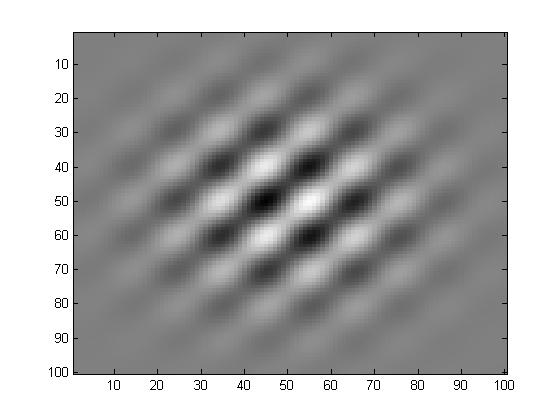
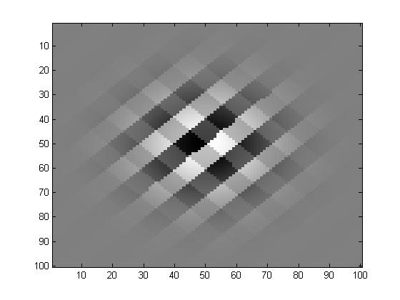
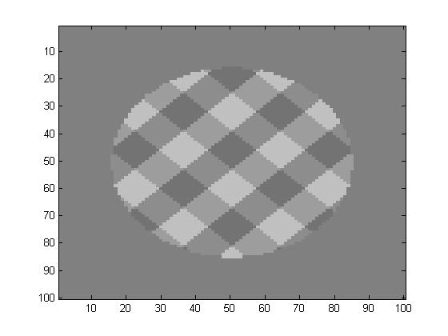
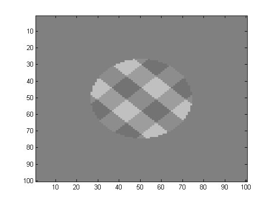
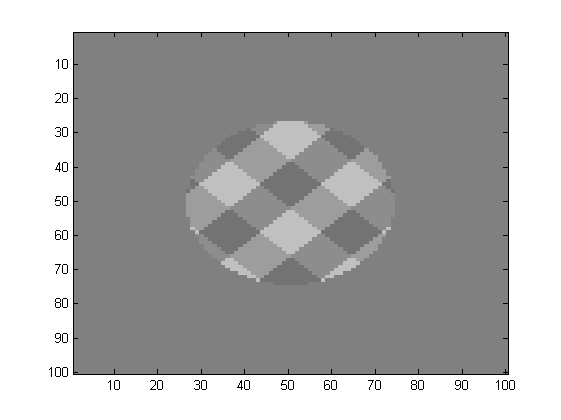

```{r setup, include=FALSE}
knitr::opts_chunk$set(echo = TRUE)
```

## Table of contents

* Experiment 1
* Experiment 2
* Experiment 3 (a,b, and c)
* Experiment 4 (a and b)
* Experiment 5
* Experiment 6

## Experiment 1

Data was collected from 2016-03-24 to 2016-04-07.

*Participants*: We collected data from 32 subjects from the SONA pool. 14 subjects were trimmed during pre-processing, leaving 18 subjects with data for analysis.

*Stimuli*: The primary stimulus of interest was a mixture of two gabor patches whose stripes were at 90 degree angles from each other. The target contrast was defined as the proportion of mixing (where a value of 1 produced an individual set of stripes rotated to the right, and a value of 0 produced an individual set of stripes rotated to the left. A value of .5 resulted in a grid with no distinguishable angle of rotation). The angle of the stripes in the patches ranged from 35 to 55 degrees in 5 degree increments.



*Procedure*: The total duration of a trial was 1,500 ms. Primes were presented for either 7, 21, 63, 188, or 563 ms. The target gabor patch was shown for 100 ms, and subsequently was masked for an additional 100 ms. The structure of a single trial was:

1. A fixation dot;
2. The prime, consisting of two dots at an angle in contained in the outer ring of the annulus.
3. The target gabor patch and a mask for the prime dots (a collection of dots at random angles in the outer ring).
4. A white noise mask of the target and a new mask for the prime.
5. The choice options (two instances of 'j' and 'k', angled respectively).

Subjects did not receive any feedback following each trial. In the experiment, subjects completed...

* A set of practice trials (1 block of 96 trials).
* An initial set of adaptive psychometric trials (1 block of 80 trials).
* A set of priming trials (2 blocks of 80 trials).
* More adaptive psychometric trials for updating (1 block of 32 trials).
* A set of priming trials (2 blocks of 80 trials).
* More adaptive psychometric trials for updating (1 block of 32 trials).
* A set of priming trials (2 blocks of 80 trials).

The types of blocks consisted of:

1. Practice trials. The practice trials consisted of a set of trials starting with perfect contrast (either 1 or 0), which then increased in difficulty in gradual increments until the contrast was almost 0.5. Subjects recieved feedback during this stage.
2. Adaptive psychometric trials. The criterion contrast level (mixing proportion) is determined in this trials using a simple two parameter logistic model, fit via an adaptive Bayesian design approach using grid approximation. The algorithm attempted to select a contrast level to produce 67% accuracy (in practice, subjects tended to have slightly higher accuracy than predicted, hence the odd value).
3. Priming trials. Every block consists of an equal mix of the 5 durations, two types of correct answers (left versus right), and the two types of prime (target versus foil).

## Experiment 2

Data was collected on 2016-04-27.

*Participants*: We collected data from 9 subjects from the SONA pool.

*Stimuli*: The primary stimulus of interest was a mixture of two gabor patches whose stripes were at 90 degree angles from each other. The gabor patches were run through a step-function to produce a grid rather than a continuous blur. The target contrast was defined as the proportion of mixing (where a value of 1 produced an individual set of stripes rotated to the right, and a value of 0 produced an individual set of stripes rotated to the left. A value of .5 resulted in a grid with no distinguishable angle of rotation). The angle of the stripes in the patches ranged from 35 to 55 degrees in 5 degree increments.



*Procedure*: The total duration of a trial was 1,500 ms. Primes were presented for either 50, 100, or 150 ms. The target gabor patch was shown for 100 ms, and subsequently was masked for an additional 100 ms. The structure of a single trial was:

1. A fixation dot;
2. The prime, consisting of two dots at an angle in contained in the outer ring of the annulus.
3. The target gabor patch and a mask for the prime dots (a collection of dots at random angles in the outer ring).
4. A white noise mask of the target and a new mask for the prime.
5. The choice options (two instances of 'j' and 'k', angled respectively).

Subjects received accuracy feedback following each trial (for 500 ms). In the experiment, subjects completed...

* A set of practice trials (1 block of 96 trials).
* An initial set of adaptive psychometric trials (1 block of 72 trials).
* A set of priming trials (2 blocks of 72 trials).
* More adaptive psychometric trials for updating (1 block of 36 trials).
* A set of priming trials (2 blocks of 72 trials).
* More adaptive psychometric trials for updating (1 block of 36 trials).
* A set of priming trials (2 blocks of 72 trials).

The types of blocks consisted of:

1. Practice trials. The practice trials consisted of a set of trials starting with perfect contrast (either 1 or 0), which then increased in difficulty in gradual increments until the contrast was almost 0.5. Subjects recieved feedback during this stage.
2. Adaptive psychometric trials. The criterion contrast level (mixing proportion) is determined in this trials using a simple two parameter logistic model, fit via an adaptive Bayesian design approach using grid approximation. The algorithm attempted to select a contrast level to produce 70% accuracy.
3. Priming trials. Every block consists of an equal mix of the 5 durations, two types of correct answers (left versus right), and the two types of prime (target versus foil).

## Experiment 3 (a,b, and c)

Data for experiment 3a was collected from 2016-10-11 to 2016-10-13. Data for experiment 3b was collected on 2016-10-27. Data for experiment 3c was collected from 2016-12-13 to 2016-12-14.

*Participants*: We collected data from 13 subjects (Experiment 3a), 18 subjects (Experiment 3b), and 14 subjects (Experiment 3c), all taken from the SONA pool. Only data from Experiment 3b was examined for preliminary analyses. In this case, 1 subject was trimmed during pre-processing, leaving 17 subjects with data for analysis.

*Stimuli*: Subjects saw overlaid stripes, producing a grid of 4 gray-scale values. The four intensities are defined via Michelson contrast for the target and foil stripes. The intensities are determined from illuminance values for the computer screen. When the target/foil ratio was 1, the stripes were indistinguishable.

The angle of the stripes in the patches ranged from 35 to 55 degrees in 5 degree increments.



*Procedure*:

The total duration of a trial was 1,500 ms. In all three experimental variants, a fixation dot was presented for either 766 or 416 ms, depending on the duration of the prime. A placeholder stimulus was shown for 600 ms. Primes were presented for either 50 or 400 ms. The target gabor patch was shown for 68 ms. The target patch was then masked for 432 ms. The structure of a single trial was:

1. A fixation dot;
2. The placeholder stimulus, a high-contrast gabor patch shown in the outer annulus with horizontal stripes, and unmoving white noise shown in the inner circle;
3. The prime, which could consist of either a neutral prime (vertical), a foil prime (rotated 90 degrees from target stripe orientation), or a target prime (rotated at same angle as target stripes orientation). Experiments 3a and 3b used only neutral primes. Primes could be either (Experiment 3a) two dots at opposite ends from each other in the outer annulus, or (Experiment 3b and 3c) a high-contrast gabor patch shown in the outer annulus and unmoving white noise shown in the inner circle;
4. The target gabor patch and a mask for the outer annulus (a collection of dots in sequence in the outer annulus);
5. A mask of both the target and prime, a shifting static mask in the inner circle and the collection of dots in the outer annulus.
6. A blank screen, during which the subject could make their choice. The response keys (j and k) were labeled with stickers showing a set of stripes orientated to the left and right respecitvely to help subjects remember the key assignments.

Subjects received accuracy feedback following each trial (for 500 ms). In the experiment, subjects completed...

* An initial set of guided examples (1 block of 5 trials).
* A set of exclusion screening trials (1 block of up to 80 trials).
* A set of practice trials (1 block of 80 trials).
* A set of psychometric trials, either...
    + Adaptive psychometric trials (Experiment 3a, 1 block of 80 trials, and after 3 blocks of primary trials, another block of 36 trials).
    + Staircase psychometric trials (Experiment 3b and 3c, 1 block of 80 trials).
* The primary trials, either...
    + Psychometric trials (Experiment 3a and 3b, 6 blocks of 60 trials).
    + Priming trials (Experiment 3c, 6 blocks of 60 trials).

The types of blocks consisted of:

1. Guided examples. The experimenter stayed with the participant during these trials. The duration of the target gabor patch was extended to 400 ms, primes were shown for 100 ms  and the target/foil ratio was set to 5 (1 block, 5 trials - not recorded).
2. Exclusion screening trials. Participants had to get 10 trials correct in a row (or the experiment was ended early). The duration of the target gabor patch was set back to 84 ms, but primes were still shown for 100 ms and the target/foil ratio was still set to 5 (1 block, maximum of 80 trials).
3. Practice trials. A neutral prime was shown for 100 ms. Subjects saw sets of 20 trials for progressively harder target/foil ratios (2, 1.5, 1.25, 1.125).
4. Adaptive psychometric trials. The criterion contrast level (target/foil ratio) is determined in this trials using a simple two parameter logistic model, fit via an adaptive Bayesian design approach using grid approximation. The algorithm attempted to select a contrast level to produce 75% accuracy.
5. Staircase psychometric trials. Over a series of trials, used a staircase algorithm to attempt to identify a target/foil ratio that would produce an average accuracy of 75%. If accuracy performance fell within a 50% confidence interval centered at 75%, the ratio was not adjusted. Increments/decrements to the ratio shrunk every 10 trials.
6. Psychometric trials. Blocks work over a combination of a sequence of 10 target/foil ratios (from 1 to 2.54), 2 prime durations, 1 prime type (neutral), and two orientations, with 9 trials per combination. At the end of each block, if the contrast was set via the staircase algorithm, the algorithm was applied again to accuracy performance for the current block (6 blocks of 60 trials).
7. Priming trials. Blocks work over a combination of a sequence of 10 target/foil ratios (from 1 to 2.54), 2 prime durations, 1 prime type (neutral), and two orientations, with 9 trials per combination. At the end of each block, if the contrast was set via the staircase algorithm, the algorithm was applied again to accuracy performance for the current block (6 blocks of 60 trials). (6 blocks of 60 trials).

## Experiment 4 (a and b)

Data for experiment 4a was collected on 2017-09-18. Data for experiment 4b was collected from 2017-09-21 to 2017-09-22.

Note that the experimental scripts are currently missing. Based on the structure of the experimental log and the variables saved in the .csv files, the pilot and final study are believed to be based on an older variant of the scripts used for Experiment 5 with different prime durations, but this cannot be confirmed at this time.

*Participants*: As a pilot study, we collected data from 6 subjects (Experiment 4a), and then collected data from 11 subjects (Experiment 4b), all taken from the SONA pool.

*Stimuli*: Subjects saw overlaid stripes, producing a grid of 4 gray-scale values. The four intensities are defined via Michelson contrast for the target and foil stripes. The intensities are determined from illuminance values for the computer screen. When the target/foil ratio was 1, the stripes were indistinguishable. The angle of the stripes in the patches ranged from 35 to 55 degrees in 5 degree increments.



*Procedure*:

The total duration of a trial was 1,500 ms. For the pilot study (Experiment 4a) the fixation dot was presented for either 766 or 416 ms, depending on the duration of the prime. For the final study (Experiment 4b) the fixation dot was presented for either 766, 766, or 0 ms, depending on the duration of the prime. Across both versions, a placeholder stimulus was shown for 600 ms. For the pilot study, primes were presented for either 50 or 400 ms. For the final study, primes were presented for either 50, 100, or 1000 ms. The target gabor patch was shown for 84 ms. The angle of the stripes in the patches ranged from 35 to 55 degrees in 5 degree increments. The structure of a single trial was:

1. A fixation dot;
2. The placeholder stimulus, a high-contrast gabor patch shown in the outer annulus with horizontal stripes, and unmoving white noise shown in the inner circle;
3. The prime, which could consist of either a neutral prime (vertical), a foil prime (rotated 90 degrees from target stripe orientation), or a target prime (rotated at same angle as target stripes orientation). Primes consisted of a high-contrast gabor patch shown in the outer annulus and unmoving white noise shown in the inner circle;
4. The target gabor patch and a mask for the outer annulus (a collection of dots in sequenc in the outer annulus);
5. A shifting static mask of the target and prime, during which the subject can make his/her choice. The response keys (j and k) were labeled with stickers showing a set of stripes orientated to the left and right respecitvely to help subjects remember the key assignments.

Subjects received accuracy feedback following each trial (for 500 ms). In the experiment, subjects completed...

* An initial set of guided examples (1 block of 5 trials).
* A set of test trials to check understanding (1 block of up to 80 trials).
* A set of practice trials (1 block of 80 trials).
* A set of psychometric trials using a staircase algorithm (1 block of 80 trials).
* A set of priming trials (6 blocks of 60 trials)

The types of blocks consisted of:

1. Guided examples. The experimenter stayed with the participant during these trials. The duration of the target gabor patch was extended to 400 ms, primes were shown for 100 ms and the target/foil ratio was set to 5 (1 block, 5 trials - not recorded).
2. Exclusion screening trials. Participants had to get 10 trials correct in a row (or the experiment was ended early). The duration of the target gabor patch was set back to 84 ms, but primes were still shown for 100 ms and the target/foil ratio was still set to 5 (1 block, maximum of 80 trials).
3. Practice trials. A neutral prime was shown at one of the 3 durations. Subjects saw sets of 20 trials for progressively harder target/foil ratios (2, 1.5, 1.25, 1.125).
4. Staircase psychometric trials. Over a series of trials, used a staircase algorithm to attempt to identify a target/foil ratio that would produce an average accuracy of 75%. If accuracy performance fell within a 50% confidence interval centered at 75%, the ratio was not adjusted. Increments/decrements to the ratio shrunk every 10 trials.
5. Priming trials. Blocks work over the combinations of two types of correct answers (left versus right), three types of prime (neutral, target, and foil), and either two prime durations (Experiment 4a) or three prime durations (Experiment 4b). At the end of every block, the staircase algorithm was applied again to the set of trials to adjust the target ratio (6 blocks, 60 trials).

## Experiment 5

Data was collected from 2017-10-20 to 2017-11-03.

*Participants*: We collected data from 56 subjects from the SONA pool. Following in-experiment exclusion screening and data pre-processing, 48 subjects had usable data. Note only 45 subjects are present in the experiment log file.

*Stimuli*: Subjects saw overlaid stripes, producing a grid of 4 gray-scale values. The four intensities are defined via Michelson contrast for the target and foil stripes. The intensities are determined from illuminance values for the computer screen. When the target/foil ratio was 1, the stripes were indistinguishable. The angle of the stripes in the patches ranged from 35 to 55 degrees in 5 degree increments.


*Procedure*:

The total duration of a trial was 1,500 ms. A fixation dot was presented for either 766 or 416 ms, depending on the duration of the prime. A placeholder stimulus was shown for 600 ms. Primes were presented for either 50 or 400 ms. The target gabor patch was shown for 84 ms. The angle of the stripes in the patches ranged from 35 to 55 degrees in 5 degree increments. The structure of a single trial was:

1. A fixation dot;
2. The placeholder stimulus, a high-contrast gabor patch shown in the outer annulus with horizontal stripes, and unmoving white noise shown in the inner circle;
3. The prime, either neutral (vertical stripes), foil (rotated 90 degrees from the target orientation), or target (equivalent rotation to the target), consisting of a high-contrast version of the gabor patch shown in the outer annulus;
4. The target gabor patch and a mask for the outer annulus (a collection of dots in sequenc in the outer annulus);
5. A shifting static mask of the target and prime, during which the subject can make his/her choice. The response keys (j and k) were labeled with stickers showing a set of stripes orientated to the left and right respecitvely to help subjects remember the key assignments.

Subjects received accuracy feedback following each trial (for 500 ms). In the experiment, subjects completed...

* An initial set of guided examples (1 block of 5 trials).
* A set of test trials to check understanding (1 block of up to 80 trials).
* A set of practice trials (1 block of 80 trials).
* A set of psychometric trials using a staircase algorithm (1 block of 80 trials).
* A set of priming trials (6 blocks of 60 trials).

The types of blocks consisted of:

1. Guided examples. The experimenter stayed with the participant during these trials. The duration of the target gabor patch was extended to 400 ms, primes were shown for 100 ms  and the target/foil ratio was set to 5 (1 block, 5 trials - not recorded).
2. Exclusion screening trials. Participants had to get 10 trials correct in a row (or the experiment was ended early). The duration of the target gabor patch was set back to 84 ms, but primes were still shown for 100 ms and the target/foil ratio was still set to 5 (1 block, maximum of 80 trials).
3. Practice trials. A neutral prime was shown at one of the 3 durations. Subjects saw sets of 20 trials for progressively harder target/foil ratios (2, 1.5, 1.25, 1.125).
4. Staircase psychometric trials. Over a series of trials, used a staircase algorithm to attempt to identify a target/foil ratio that would produce an average accuracy of 75%. If accuracy performance fell within a 50% confidence interval centered at 75%, the ratio was not adjusted. Increments/decrements to the ratio shrunk every 10 trials.
5. Priming trials. Blocks work over the combinations of two types of correct answers (left versus right), three types of prime (neutral, target, and foil), and the two prime durations. At the end of every block, the staircase algorithm was applied again to the set of trials to adjust the target ratio (6 blocks, 60 trials).

## Experiment 6

Data was collected from 2017-11-22 to 2017-11-29.

This experiment has the first implementation allowing for either forced-choice or same-different responses. Data was collected for only the forced-choice option. Note that when data was recorded, the option was erroneously set to "C" (same-different), when it should actually be "B" (force-choice), as in the experiment log.

*Participants*: We collected data from 5 subjects, 4 from the SONA pool and 1 volunteer from the lab.

*Stimuli*: Subjects saw overlaid stripes, producing a grid of 4 gray-scale values. The four intensities are defined via Michelson contrast for the target and foil stripes. The intensities are determined from illuminance values for the computer screen. When the target/foil ratio was 1, the stripes were indistinguishable.

The angle of the stripes in the patches ranged from 35 to 55 degrees in 5 degree increments.



*Procedure*:

The total duration of a trial was 1,400 ms. A fixation dot was presented for 317 ms. A placeholder stimulus was shown for 392, 366, or 266 ms, depending on the duration of the prime. Primes were presented for 8, 34, and 134 ms. The target gabor patch was shown for 84 ms. The angle of the stripes in the patches ranged from 35 to 55 degrees in 5 degree increments. The structure of a single trial was:

1. A fixation dot;
2. The placeholder stimulus, a high-contrast gabor patch shown in the outer annulus with horizontal stripes, and unmoving white noise shown in the inner circle;
3. The prime, either foil (rotated 90 degrees from the target orientation) or target (equivalent rotation to the target) primed, consisting of a high-contrast version of the gabor patch shown in the outer annulus;
4. The target gabor patch and a mask for the outer annulus (a collection of dots in sequenc in the outer annulus);
5. A shifting static mask of the target and prime, during which the subject can make his/her choice. The response keys (j and k) were labeled with stickers showing a set of stripes orientated to the left and right respecitvely to help subjects remember the key assignments.

Subjects received accuracy feedback following each trial (for 400 ms). In the experiment, subjects completed...

* An initial set of guided examples (1 block of 5 trials).
* A set of test trials to check understanding (1 block of up to 80 trials).
* A set of practice trials (1 block of 80 trials).
* A set of psychometric trials using a staircase algorithm (1 block of 80 trials).
* A set of priming trials (9 blocks of 60 trials).

The types of blocks consisted of:

1. Guided examples. The experimenter stayed with the participant during these trials. The duration of the target gabor patch was extended to 400 ms, primes were shown for 100 ms and the target/foil ratio was set to 5 (1 block, 5 trials).
2. Test trials for understanding. Participants had to get 10 trials correct in a row (or the experiment was ended early). The duration of the target gabor patch was set back to 84 ms, but primes were still shown for 100 ms and the target/foil ratio was still set to 5 (1 block, maximum of 80 trials).
3. Practice trials. Primes were shown for 100 ms. Subjects saw sets of 20 trials for progressively harder target/foil ratios (2, 1.5, 1.25, 1.125).
4. Staircase psychometric trials. Over a series of trials, used a staircase algorithm to attempt to identify a target/foil ratio that would produce an average accuracy of 75%. If accuracy performance fill within a 50% confidence interval centered at 75%, the ratio was not adjsuted. Increments/decrements to the ratio shrunk every 10 trials.
5. Priming trials. Blocks work over the combinations of two types of correct answers (left versus right), two types of prime (target and foil), and the three prime durations. At the end of every block, the staircase algorithm was applied again to the set of trials to adjust the target ratio (9 blocks, 60 trials).


